# 前置知识

## 前言

对于我这样的高性能计算领域的新人来说，对于并行计算的理解掺杂了许多错误概念和认知，这些认知要么是受科幻电影或者从其它渠道影响。比如，我一开始以为多核CPU是所有的核运行完全不一样的程序，能够高效配合完成各种任务，所以我对这种并行计算任务的设计难度有一种不切实际的认识。当然，这其实也不能完全说是错误的认知，因为我是把以前做FPGA的观念转移到这里，完全高效配合是并行计算的最理想状态。

实际上可以把多核CPU理解成一支军队，每个士兵就是一个核心，有一个总体目标（某个计算任务）。开始做这个总体目标的时候，会发布一系列命令（即包含所有CPU指令的**一个**程序）。类似只有一个发布指挥命令的最高单位，计算任务也只有一个程序，所有CPU都要从这个程序中接收或者寻找子任务。这种内生的指令广播特性使得所有核心运行或者说访问同一个程序，随着命令的发布，所有士兵都开始动员起来，每个士兵都会知道这些命令，但每个士兵只会听要求他的命令（即通过if-else这样的分支判断选择不同的子任务）。从士兵的视角来看，每个士兵都运行不同的子任务，对于最高统帅，他就只发布了一个总体命令集合（即一个完整的程序）。以下，我们会经常用士兵与军队的比喻来理解并行计算。
类似军队的班、排、战斗小组等概念，CPU、GPU中也有类似的东西。


## 架构知识：UMA、NUMA、MPP

参考（https://blog.csdn.net/weixin_43947279/article/details/86306501和https://cloud.tencent.com/developer/article/1372348）

### UMA：班级
一致存储器访问结构(UMA：Uniform Memory Access)指各CPU共享相同的物理内存，每个 CPU访问内存中的任何地址所需时间是相同的。通常多个CPU对称工作，无主次或从属关系，但有些厂商会专门设置管理核或者指定某些核不承担计算任务，分担资源分配等任务，让计算核专注计算，因此有些CPU上一个cluster的核心数是奇怪的数字，比如38。

由于每个CPU必须通过相同的内存总线访问相同的内存资源，因此随着CPU数量的增加，内存访问冲突将迅速增加，最终会造成CPU资源的浪费，使CPU性能的有效性大大降低。当然还有其它因素，比如不同位置引入的不一致延迟的限制。实验证明，这种服务器CPU利用率最好的情况是2至4个CPU，因此4这个数字会出现在很多CPU和GPU的架构中。

UMA的CPU数目不是越多越好，这个可以类比一个班级作战单位，班长对于每个战士的了解程度和安排合理性是有上限的，指挥效率不是线性的。

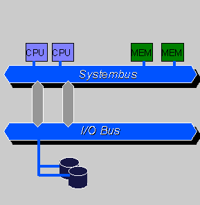

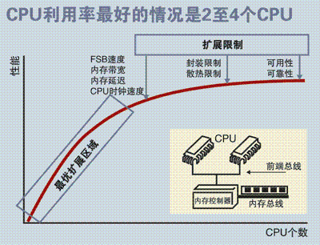


### NUMA：排、连级

由于UMA在扩展能力上的限制，人们开始探究如何进行有效地扩展从而构建大型系统的技术，NUMA就是这种努力下的结果之一。利用NUMA技术，可以把几十个CPU(甚至上百个CPU)组合在一个服务器内。

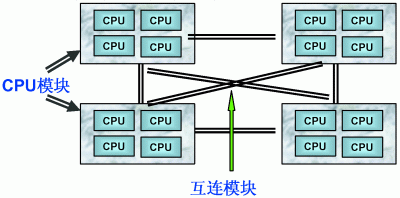

NUMA服务器的基本特征是具有多个CPU模块，每个CPU模块由多个CPU(如4个)组成，并且具有独立的本地内存、I/O槽口等。节点之间可以通过互联模块(如Crossbar Switch)进行连接和信息交互，因此**每个CPU可以访问整个系统的内存**(这是NUMA系统与MPP系统的重要差别)。显然，访问本地内存的速度将远远高于访问远地内存(系统内其它节点的内存)的速度，这也是非一致存储访问NUMA的由来。一般需要通过numactl来设置就近访存。这里类比排、连级是因为有时候不是只有一级NUMA安排。

### MPP：营级

MPP(Massive Parallel Processing)由多个UMA或NUMA服务器通过一定的节点互联网络进行连接、协同工作、完成相同的任务，从用户的角度来看是一个服务器系统。每个节点只访问自己的本地资源(内存、存储等)，是一种完全无共享(Share Nothing)结构（每个节点内的CPU不能访问另一个节点的内存），因而扩展能力最好，理论上其扩展无限制。

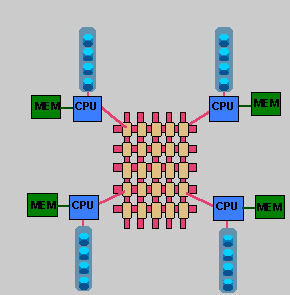


## SIMT和SIMD：超级战士与多数普通士兵PK

从字面意思，SIMT（single instruction multple threads，单指令多线程）和SIMD（single instruction multple data，单指令多数据）比较接近，但区别在于SIMT是多个线程（处理单元）执行相同的指令，但处理各自独立的数据；SIMD是一条指令同时操作多个数据元素（一个向量寄存器或者一个处理单元），广义上SIMD是包含SIMT的，但通常这些数据由一个处理单元进行处理。简单来说，SIMD是数量不多的超级战士组成的战斗小组，每个超级战士能完成多个任务，而SIMT是数量较多的普通战士，每个能力不强，但胜在数量多，这两种都可以完成相同的任务。

他们的区别主要如下：

| 特性维度   | SIMD (单指令多数据)                                          | SIMT (单指令多线程)                                    |
| ------ | ------------------------------------------------------ | ------------------------------------------------ |
| 核心思想   | 一条指令同时操作多个数据元素                                         | 多个线程（处理单元）执行相同的指令，但处理各自独立的数据                     |
| 编程抽象   | 显式数据向量化。开发者或编译器需要将数据组织成向量，并使用特定的向量指令（如VADD）。           | 隐式线程并行。开发者编写处理单个数据的标量代码（如CUDA线程），硬件自动组织大量线程并行执行。 |
| 硬件执行   | 所有处理单元必须对连续或规整的数据执行完全相同的操作或者通过掩码确定执行的通道。               | 多个标量线程被动态分组（如32个线程为1个Warp线程束）。                   |
| 控制流处理  | 所有数据通道必须执行相同的控制流路径，分支会显著降低效率。                          | 支持条件分支。允许线程独立执行不同的分支（如if/else），但会导致线程发散，可能降低性能。  |
| 主要应用场景 | CPU的向量指令扩展（如SSE, AVX，ARM的NEON、SVE、SME）、早期的GPU、一些AI加速器。 | 现代GPU（尤其是NVIDIA CUDA架构）的主流执行模型。                  |

以一个并行计算任务为例：SISD（单指令单数据）、SIMT、SIMD的执行的过程如下

```C++
for (int i = 0; i < N; ++i) 
    C[i] = A[i] + B[i];
```

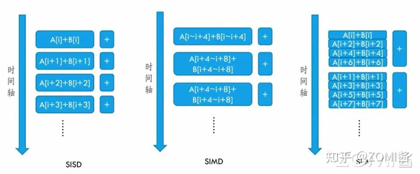
图片来源：https://zhuanlan.zhihu.com/p/5739361088

SISD每次只取一对数据进行计算；SIMD操作允许一次读取多个数据，存放在能容纳这些数据的一个长宽度寄存器中（A存放在一个长寄存器，B存放在一个长寄存器），经过单个加法器（或者其它复杂的处理器）计算得到结果；SIMT操作允许一次读取多个数据，存放在多个寄存器中（A存放在多个寄存器），经过多个处理器（相对简单的处理器），同时进行相同的计算操作得到结果。


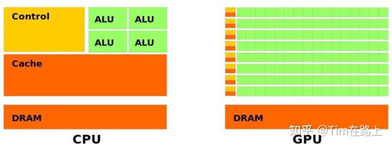
图片来源：https://zhuanlan.zhihu.com/p/678001378

通常来说，CPU和GPU的结构类似，但各个部分的复杂程度和数量不一致，为了特定目标设计。CPU的ALU部分复杂但数目稀少，GPU的ALU结构复杂但数目众多，控制结构也是，CPU控制支持分支预测、乱序执行等技术手段，GPU控制器只能执行较为简单的指令。操作复杂度和处理单元的数目差异导致二者编程的巨大差异。


## 内存系统：物资管理系统

内容和图片来源：https://zhuanlan.zhihu.com/p/37749443

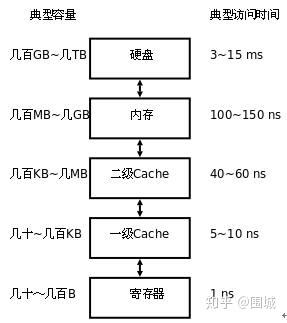

存储器是分层次的，离处理器越近的存储器，速度越快，每字节的成本越高，同时容量也因此越小。寄存器速度最快，离处理器最近，成本最高，所以个数容量有限，其次是高速缓存（缓存也是分级，有L1，L2等缓存），再次是主存（普通内存），再次是本地磁盘。

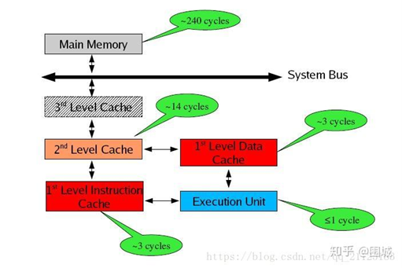

存储器分级，利用的是局部性原理。我们可以以经典的阅读书籍为例。我在读的书，捧在手里（寄存器），我最近频繁阅读的书，放在书桌上（缓存），随时取来读。当然书桌上只能放有限几本书。我更多的书在书架上（内存）。如果书架上没有的书，就去图书馆（磁盘）。我要读的书如果手里没有，那么去书桌上找，如果书桌上没有，去书架上找，如果书架上没有去图书馆去找。可以对应寄存器没有，则从缓存中取，缓存中没有，则从内存中取到缓存，如果内存中没有，则先从磁盘读入内存，再读入缓存，再读入寄存器。

### Cacheline

在读取的时候，一般内存是以cacheline的形式读取数据，不是只读取一个B数据。更详细的解释清参考：https://www.cnblogs.com/gujiangtaoFuture/articles/11163844.html。地址分段解析如下所示：

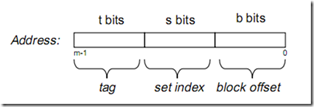

tag, set index, block offset三个区间对应Cache的逻辑结构如下：

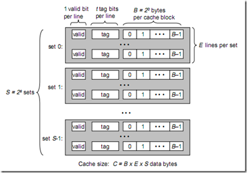


一个cache被分为S个组，每个组有E个cacheline，而一个cacheline中，有B个存储单元，现代处理器中，这个存储单元一般是以字节(通常8个位)为单位的，也是最小的寻址单元。因此，在一个内存地址中，中间的s位决定了该单元被映射到哪一组，而最低的b位决定了该单元在cacheline中的偏移量。valid通常是一位，代表该cacheline是否是有效的(当该cacheline不存在内存映射时，当然是无效的)。tag就是内存地址的高t位，因为可能会有多个内存地址映射到同一个cacheline中，所以该位是用来校验该cacheline是否是CPU要访问的内存单元。

当tag和valid校验成功时，我们称为cache命中，这时只要将cache中的单元取出，放入CPU寄存器中即可。当tag或valid校验失败的时候，就说明要访问的内存单元(也可能是连续的一些单元，如int占4个字节，double占8个字节)并不在cache中，这时就需要去内存中取了，这就是cache不命中的情况(cache miss)。当不命中的情况发生时，系统就会从内存中取得该单元，将其装入cache中，与此同时也放入CPU寄存器中，等待下一步处理。


### GPU共享内存

英伟达GPU上的共享内存不是以cacheline形式访存，是以bank形式组织排布（https://zhuanlan.zhihu.com/p/659142274），连续映射（即原文的 successive 32-bit words map to successive banks）按4Byte或者8Byte 映射到同一个Bank。

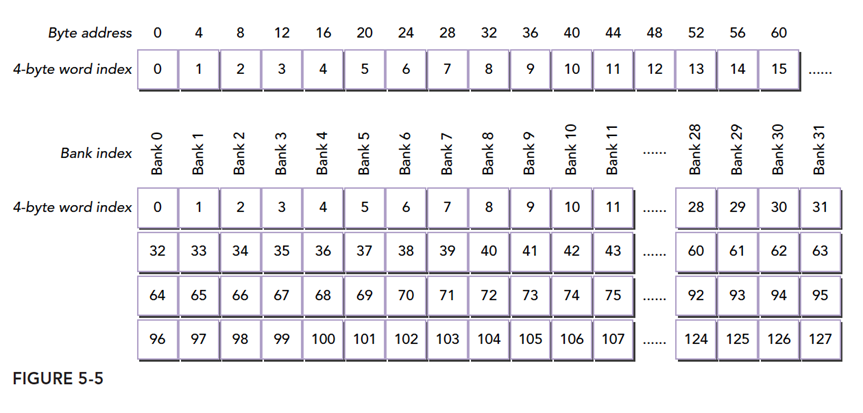

对于这个共享内存的访存需要仔细对待，具体参考谭升的博客（https://face2ai.com/CUDA-F-5-1-CUDA%E5%85%B1%E4%BA%AB%E5%86%85%E5%AD%98%E6%A6%82%E8%BF%B0/）

最优访问模式（并行不冲突）：

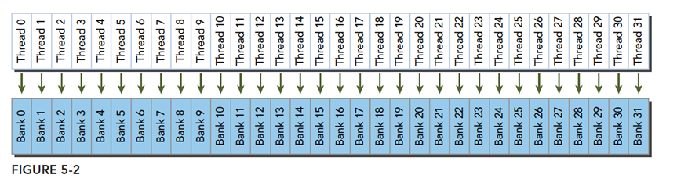

不规则的访问模式（并行不冲突）：

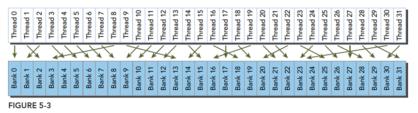

不规则的访问模式（并行可能冲突，也可能不冲突）

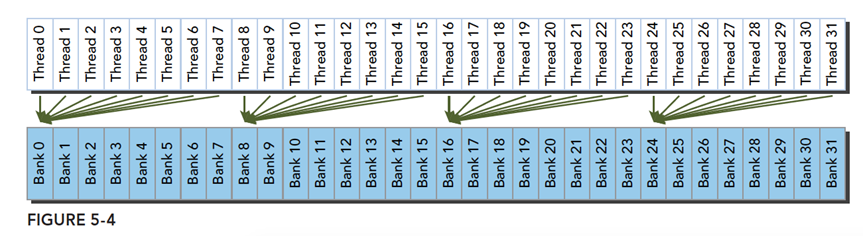


# 架构

## GPU类

### 英伟达：SIMT
英伟达系列芯片是基于SMIT（单指令多线程）进行计算控制调度的。从编程角度来说，通常是以一个warp（线程束，英伟达是32个线程）进行控制，即一个指令可以同时控制32个线程进行操作。一个线程网格里包含多个线程块，一个线程块包含多个warp。Cuda算子底层是通过线程块和线程网格进行调整，H100增加了线程簇（cluster）这个级别调度，增加了优化自由度。

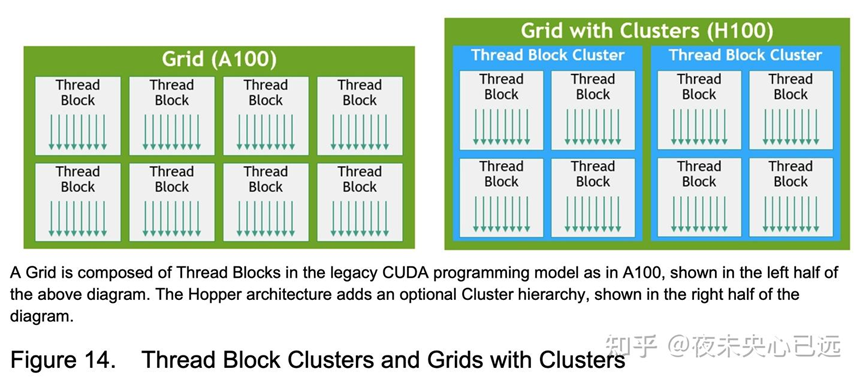

GPU上有很多SM（流处理器），一个线程块只能在一个SM上运行，反过来，一个SM不一定只运行一个线程块。一个SM上包含很多资源，具体参考https://blog.nowcoder.net/n/4dcb2f6a55a34de9ae6c9067ba3d3bfb 和
https://zhuanlan.zhihu.com/p/394352476。

GPU通过硬件层面的巧妙设计，隐藏了内存访问延迟，这里涉及到资源占用率问题（Occupancy问题，线程块里活跃的warp数比warp理论数，占用率高，说明内存访问的延迟被调用其它warp给覆盖掩藏程度越高）。
* 海量硬件线程：一个GPU内核可以启动成千上万个线程，这些线程在硬件层面被组织成Warp进行管理。
* 零开销上下文切换：当一个Warp因为等待内存读取而停滞时，GPU的硬件调度器会瞬间切换到另一个就绪的Warp，继续执行其指令。由于所有线程的状态（寄存器值）都已在片上，切换成本几乎为零。这样，GPU的计算单元几乎永远处于忙碌状态，从而压榨出极高的硬件利用率。

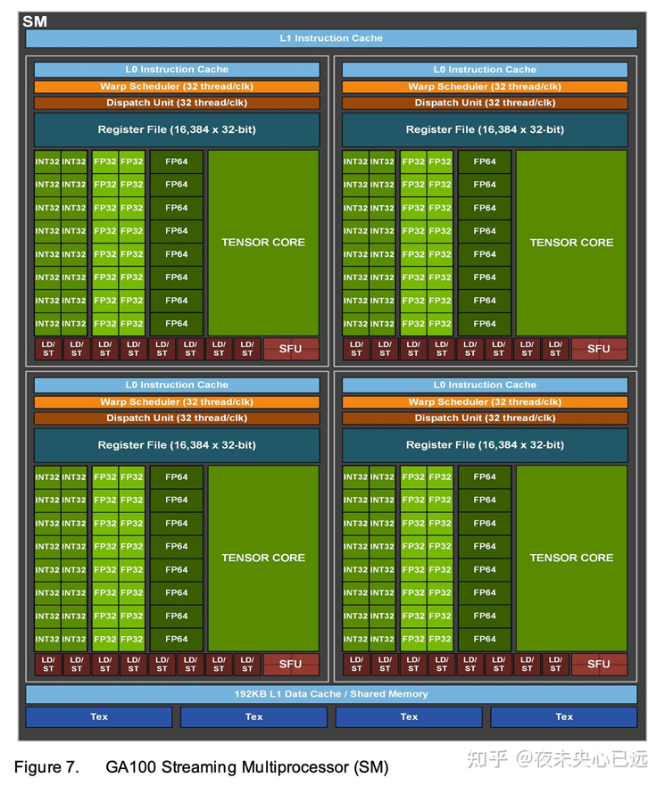
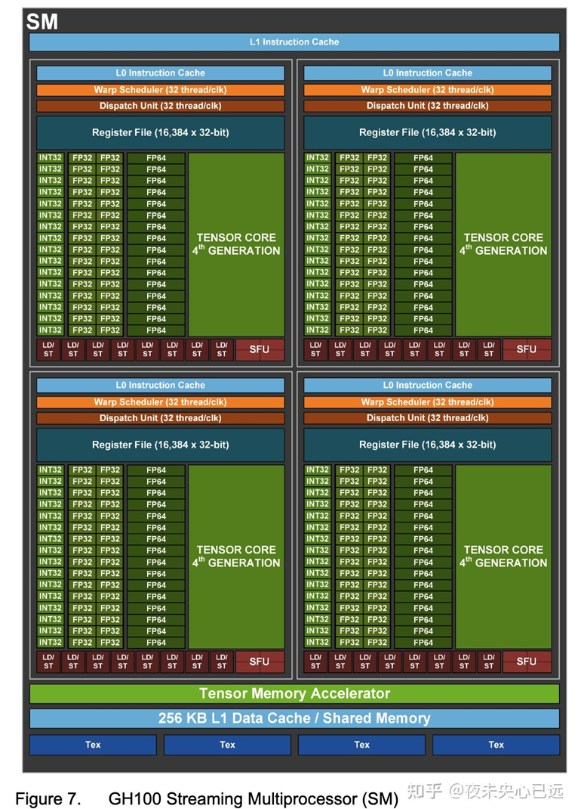

A100和H100两款GPU的每个SM在物理上都分为四个处理块，可以粗略地理解为 “四个子SM”。不同点在于，H100支持 “线程块集群” ，优化内部并行的同时，为跨线程块的交互提供基础，可以通过分布式共享内存直接通信,此时这四个子SM呈现UMA架构，不同的SM呈现NUMA架构。此外，H100还有TMA加速数据搬移。

### AMD （海光DCU）：SIMD

#### 硬件架构

#### 软件编程模型
参考https://rocm.docs.amd.com/projects/HIP/en/latest/understand/hardware_implementation.html

与英伟达的SM不同的是，AMD和海光的CU模型是基于SIMD模块，SIMD的位宽是确定的，因此CU的线程束最小调度单位（wavefront size）与英伟达的warp是不完全一样的，**wavefront可以是32，也可以是64**，与架构有关系。可以观察到，一个CU里有4个SIMD模块，这个与英伟达一个SM里有4个子单元类似。AMD的GPU的技术来源猜测是来自服务器，使用SIMD做GPU可以继承很多原有成熟可靠的技术。AMD也支持上下文切换，编程的时候，大部分可以理解成英伟达的卡的样子。

海光的技术来源于AMD，因此架构上有极大的相关性，有一点不同的是，**海光目前仅能支持4个线程束**，即这四个SIMD模块各自只能运行一次，不支持上下文切换的功能，在使用Triton编程的时候注意一下。


多个CU组合，共享内存控制器件和特殊函数计算模块。多芯片（MCM）架构的特殊性：在AMD Instinct MI系列（如MI250X、MI300X）这类多芯片GPU中，每个计算芯片（XCD）拥有自己独立的L2和L3缓存。跨芯片的数据访问需要通过更慢的Infinity Fabric互联，形成非统一内存访问（NUMA） 架构。
每个CU都有私有的L1缓存，一个XCD上共享L2缓存，一个GPU上所有XCD共享L3缓存。


## NPU类

### 昇腾


### 寒武纪

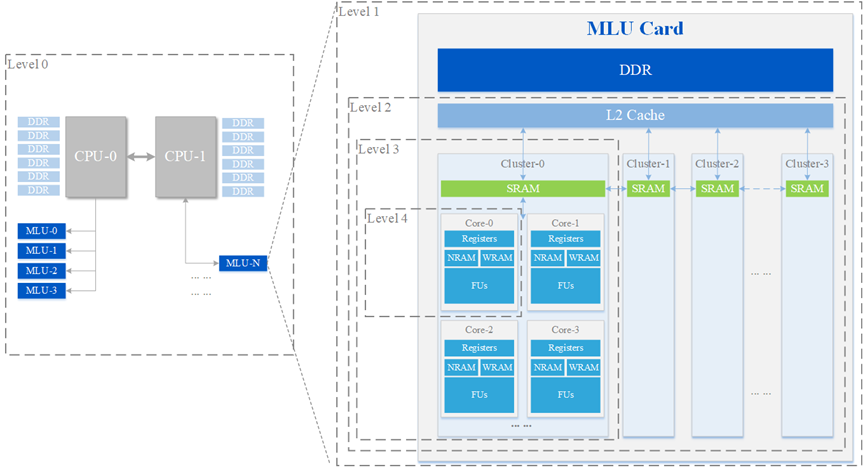

* 第0级是服务器级，由多个 CPU 构成的控制单元、本地 DDR 存储单元和多个 MLU 板卡构成的计算单元组成；
* 第1级是板卡级，包含本地控制单元、DDR 存储单元和 MLU 芯片构成的计算单元组成；
* 第2级是芯片级，包含本地控制单元、本地存储单元（例如 L2 Cache）以及一个或者多个 Cluster 构成的计算单元组成；
* 第3级是 Cluster 级，包含本地控制单元、共享存储以及多个 MLU Core 构成的计算单元组成；
* 第4级是 MLU Core 级，包含本地控制单元、私有存储单元和计算单元组成。在 MLU Core 内部支持指令级并行和数据级并行。

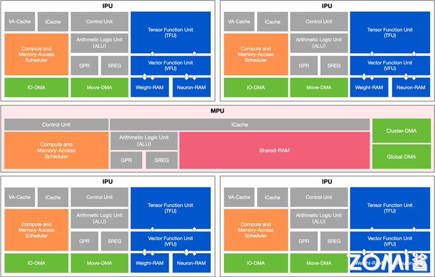

通常一个cluster上有四个MLU Core，配一个内存core。各个core的计算是独立的，实际类似多核CPU，推测是简化了控制器。
需要将一个复杂任务（如AI算子）分解为多个子任务，分配给Cluster内不同核心执行。有资料提示寒武纪的架构可以乱序执行。暂时未找到延迟隐藏的资料。


## CPU类

### ARM服务器系列：SIMD

主要涉及SVE和SME指令的使用（参考资料https://www.cnblogs.com/wenbinteng/p/19052964、https://www.cnblogs.com/wenbinteng/p/19040115）